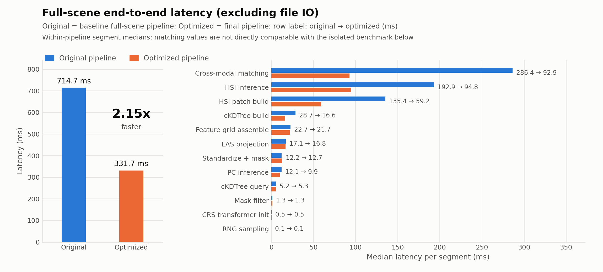
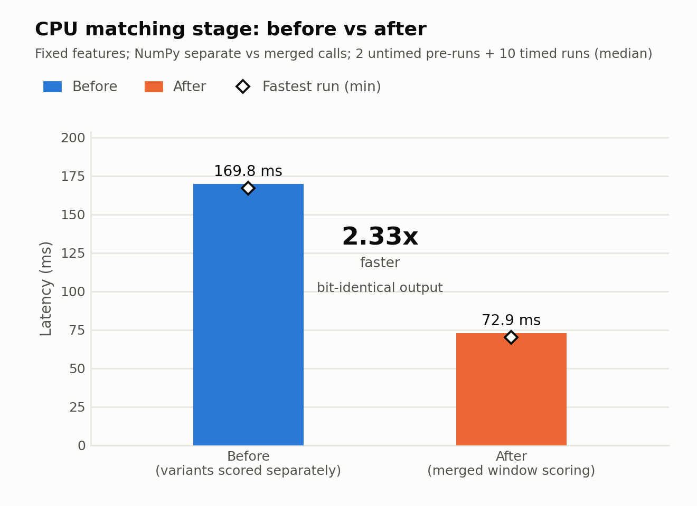
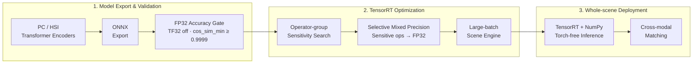

# hspc-transformer-edge-inference

本仓库是我基于自己的硕士课题（HSI-LiDAR 点云与高光谱跨模态特征匹配）独立完成的端侧推理部署改造项目。
我将课题中已训练完成的两个 Transformer 编码器（点云 PC / 高光谱 HSI）导出为 ONNX，构建
TensorRT FP32、FP16 和 INT8 推理引擎，以 PyTorch FP32 为基线完成精度验证与 benchmark，
并优化了不依赖 torch 的整景批量推理链路。所有实测数据在 NVIDIA RTX 3060 12GB（WSL2）上取得。

环境：TensorRT 10.13.3.9（CUDA 12.9）｜PyTorch 2.13.0（CUDA 13.0，FP32 基线）｜Python 3.10｜
ONNX opset 17｜RTX 3060 12GB（SM 8.6，WSL2）。

公开脚本的软件依赖与系统前提见 [docs/environment.md](docs/environment.md)。

## 公开范围

本仓库不含：模型结构定义、训练权重、原始/校准样本数据（均属于未发表的硕士课题内容），
以及跨模态匹配打分规则（`scripts/matching.py`，课题方法本身）。

本仓库包含：除课题私有模型定义、训练权重和跨模态匹配规则外的部署工程代码，包括 ONNX 导出、
TensorRT 构建、精度验证、benchmark 和整景推理链路优化，以及对应实验结果 JSON。由于模型结构、
训练权重及跨模态匹配规则未公开，本仓库无法独立完成端到端复现；公开内容用于展示部署工程实现、
实验方法与结果证据。

## 使用与授权

本仓库仅供成果展示与技术审阅，保留一切权利。除 GitHub 服务条款允许的平台内使用、查看和 fork 外，未经作者事先
书面许可，不得复制、修改、再发布、商业使用或创作衍生作品。详见 [LICENSE](LICENSE)。

## 结果速览

| 指标 | 结果 | 来源 |
|---|---|---|
| FP16 路径精度（cos_sim_min / 同模态最近邻 Top-1 一致率，200 条，vs PyTorch FP32） | PC 0.999998 / 99.5%　HSI 0.999847 / 99.0% | `results/stage2_trt_accuracy.json` |
| 单样本推理加速比（batch=1，p50，vs PyTorch FP32-GPU） | PC 5.8x　HSI 7.3x | `results/stage3_benchmark.json` |
| 整景端到端耗时（不含IO，同进程对比） | 714.7ms → 331.7ms（**2.15x**），基线为未优化的原始推理链路 | `results/stage7_final_e2e.json`（`overall_speedup_without_io`） |
| 跨模态匹配任务一致率（最终混合精度部署版 vs PyTorch FP32，1000点/景） | DTP 99.7%　DTP+Spatial 99.5% | `results/stage7_mixed_precision.json` |

## 整景耗时与 CPU 段优化



Original 为原始整景验证链路，Optimized 为最终整景链路；取 `forward` 方向、不含文件 IO 的各分段中位数
（`results/stage7_final_e2e.json`，`forward.<配置>.segments_ms.<分段>.median_ms`）。图中 matching 的
286.4 → 92.9 ms 是两套整景流水线各自的分段中位数，除匹配实现外也受整条流水线配置影响。



该图固定输入特征，只对 NumPy 分开调用与合并调用进行独立微基准；每种实现计时前执行两次不计时预运行，随后重复
测量 10 次并取中位数。匹配段合并两个匹配变体、共享窗口内的 cosine/distance 计算（见技术要点第 2 条），前后输出
逐位一致（`results/stage7_cpu_profile.json` 的 `optimization_b_merged_score_window`）。因此图中的 72.9 ms 不能与
上一图整景流水线中的 92.9 ms 直接比较。

## 结果总表

<!-- results-table:start -->
对比基准为 PyTorch FP32（GPU）；精度在 200 条验证样本上计算，其中同模态最近邻 Top-1 一致率表示：分别排除样本自身后，PyTorch 与 TensorRT 在同模态样本中检索到同一个最近邻的比例；延迟为 batch=1 的 p50（warmup 50 / measure 300，CUDA event 计时）。表中 `[batch=1]` 表示列表里 `batch` 字段等于 1 的元素；字段级来源与补充验证信息见下方折叠 provenance。

| Model | Backend | Precision | Accuracy (cos_sim_min / same-modal NN Top-1 agreement) | Latency (batch=1, p50, ms) | Speedup vs PyTorch FP32 |
|---|---|---|---|---|---|
| PC | PyTorch | FP32 | reference | 1.577 | 1.0x |
| PC | TensorRT | FP32 (TF32 off) | 1.000000 / 100.0% | 0.397 | 4.0x |
| PC | TensorRT | FP32 (TF32 on) | 1.000000 / 100.0% | 0.353 | 4.5x |
| PC | TensorRT | FP16 mixed | 0.999998 / 99.5% | 0.273 | 5.8x |
| PC | TensorRT | INT8 (implicit calibration) | 0.999994 / 100.0% | 0.292 | 5.4x |
| HSI | PyTorch | FP32 | reference | 1.820 | 1.0x |
| HSI | TensorRT | FP32 (TF32 off) | 1.000000 / 100.0% | 0.420 | 4.3x |
| HSI | TensorRT | FP32 (TF32 on) | 0.999997 / 100.0% | 0.353 | 5.2x |
| HSI | TensorRT | FP16 mixed | 0.999847 / 99.0% | 0.248 | 7.3x |
| HSI | TensorRT | INT8 (implicit calibration) | 0.991568 / 98.0% | 0.263 | 6.9x |
| HSI | TensorRT | INT8 (QDQ) | 0.754749 / 91.0% | 0.301 | 6.0x |

PC 的 INT8 QDQ 路径已放弃，说明见「技术要点」第 3 条。

<!-- results-table:end -->

**数据来源与口径**

- 精度：`results/stage2_trt_accuracy.json`
- batch=1 延迟：`results/stage3_benchmark.json`
- Speedup：`PyTorch FP32-GPU p50 / 对应 TensorRT p50`
- `stage2_trt_accuracy.json` / `stage3_benchmark.json` 中的 `fp16` / `trt_fp16` 对应当前 `engines/*_fp16.plan`，即最终选择性混合精度引擎；旧 auto 引擎的性能结果见 `trt_fp16_legacy`，精度对照见 `results/stage7_mixed_precision.json` 的 `final_engines_promoted.note`。
- 最终选择性混合精度方案、稳定性验证与任务级一致率见 `results/stage7_mixed_precision.json`。
- PC 的 INT8 QDQ 路径已放弃，原因见「技术要点」第 3 条。

<details>
<summary><strong>展开查看字段级 provenance</strong></summary>

### PC

- PyTorch FP32 latency：`results/stage3_benchmark.json` → `results.pc.pytorch_fp32_gpu[batch=1].p50_ms`
- PyTorch FP32 speedup：基线自身相除，定义为 `1.0x`
- TensorRT FP32 (TF32 off) accuracy：`results/stage2_trt_accuracy.json` → `results.pc.fp32_notf32.cos_sim_min`, `results.pc.fp32_notf32.top1_agreement`
- TensorRT FP32 (TF32 off) latency：`results/stage3_benchmark.json` → `results.pc.trt_fp32_notf32[batch=1].p50_ms`
- TensorRT FP32 (TF32 off) speedup：`results.pc.pytorch_fp32_gpu[batch=1].p50_ms / results.pc.trt_fp32_notf32[batch=1].p50_ms`
- TensorRT FP32 (TF32 on) accuracy：`results/stage2_trt_accuracy.json` → `results.pc.fp32_tf32.cos_sim_min`, `results.pc.fp32_tf32.top1_agreement`
- TensorRT FP32 (TF32 on) latency：`results/stage3_benchmark.json` → `results.pc.trt_fp32_tf32[batch=1].p50_ms`
- TensorRT FP32 (TF32 on) speedup：`results.pc.pytorch_fp32_gpu[batch=1].p50_ms / results.pc.trt_fp32_tf32[batch=1].p50_ms`
- TensorRT FP16 accuracy：`results/stage2_trt_accuracy.json` → `results.pc.fp16.cos_sim_min`, `results.pc.fp16.top1_agreement`；同配置另有 5 次独立构建的稳定性验证，cos_sim_min 为 0.999995–0.999998（`results/stage7_mixed_precision.json` → `pc.stability.cos_mins`）
- TensorRT FP16 latency：`results/stage3_benchmark.json` → `results.pc.trt_fp16[batch=1].p50_ms`
- TensorRT FP16 speedup：`results.pc.pytorch_fp32_gpu[batch=1].p50_ms / results.pc.trt_fp16[batch=1].p50_ms`
- TensorRT INT8 implicit accuracy：`results/stage2_trt_accuracy.json` → `results.pc.int8_implicit.cos_sim_min`, `results.pc.int8_implicit.top1_agreement`
- TensorRT INT8 implicit latency：`results/stage3_benchmark.json` → `results.pc.trt_int8_implicit[batch=1].p50_ms`
- TensorRT INT8 implicit speedup：`results.pc.pytorch_fp32_gpu[batch=1].p50_ms / results.pc.trt_int8_implicit[batch=1].p50_ms`

### HSI

- PyTorch FP32 latency：`results/stage3_benchmark.json` → `results.hsi.pytorch_fp32_gpu[batch=1].p50_ms`
- PyTorch FP32 speedup：基线自身相除，定义为 `1.0x`
- TensorRT FP32 (TF32 off) accuracy：`results/stage2_trt_accuracy.json` → `results.hsi.fp32_notf32.cos_sim_min`, `results.hsi.fp32_notf32.top1_agreement`
- TensorRT FP32 (TF32 off) latency：`results/stage3_benchmark.json` → `results.hsi.trt_fp32_notf32[batch=1].p50_ms`
- TensorRT FP32 (TF32 off) speedup：`results.hsi.pytorch_fp32_gpu[batch=1].p50_ms / results.hsi.trt_fp32_notf32[batch=1].p50_ms`
- TensorRT FP32 (TF32 on) accuracy：`results/stage2_trt_accuracy.json` → `results.hsi.fp32_tf32.cos_sim_min`, `results.hsi.fp32_tf32.top1_agreement`
- TensorRT FP32 (TF32 on) latency：`results/stage3_benchmark.json` → `results.hsi.trt_fp32_tf32[batch=1].p50_ms`
- TensorRT FP32 (TF32 on) speedup：`results.hsi.pytorch_fp32_gpu[batch=1].p50_ms / results.hsi.trt_fp32_tf32[batch=1].p50_ms`
- TensorRT FP16 accuracy：`results/stage2_trt_accuracy.json` → `results.hsi.fp16.cos_sim_min`, `results.hsi.fp16.top1_agreement`；同配置另有 5 次独立构建的稳定性验证，cos_sim_min 为 0.999784–0.999801（`results/stage7_mixed_precision.json` → `hsi.stability.cos_mins`）
- TensorRT FP16 latency：`results/stage3_benchmark.json` → `results.hsi.trt_fp16[batch=1].p50_ms`
- TensorRT FP16 speedup：`results.hsi.pytorch_fp32_gpu[batch=1].p50_ms / results.hsi.trt_fp16[batch=1].p50_ms`
- TensorRT INT8 implicit accuracy：`results/stage2_trt_accuracy.json` → `results.hsi.int8_implicit.cos_sim_min`, `results.hsi.int8_implicit.top1_agreement`
- TensorRT INT8 implicit latency：`results/stage3_benchmark.json` → `results.hsi.trt_int8_implicit[batch=1].p50_ms`
- TensorRT INT8 implicit speedup：`results.hsi.pytorch_fp32_gpu[batch=1].p50_ms / results.hsi.trt_int8_implicit[batch=1].p50_ms`
- TensorRT INT8 QDQ accuracy：`results/stage2_trt_accuracy.json` → `results.hsi.int8_qdq.cos_sim_min`, `results.hsi.int8_qdq.top1_agreement`
- TensorRT INT8 QDQ 补充核查：同一 QDQ 图经 TensorRT 独立重建 3 次，cos_sim_min 为 0.7474–0.7547；不经 TensorRT、直接用 ONNX Runtime 运行该 QDQ 模型，cos_sim_min 为 0.7858–0.8582，同样偏低（`results/hsi_qdq_check.json` → `trt_rebuilds[*].cos_sim_min`、`ort_direct.*.cos_sim_min`）。因此这是 QDQ 量化误差本身较大，不是 PC 路径那种 TensorRT 重建后输出数值异常的问题。
- TensorRT INT8 QDQ latency：`results/stage3_benchmark.json` → `results.hsi.trt_int8_qdq[batch=1].p50_ms`
- TensorRT INT8 QDQ speedup：`results.hsi.pytorch_fp32_gpu[batch=1].p50_ms / results.hsi.trt_int8_qdq[batch=1].p50_ms`

</details>

以上图表和总表由 `scripts/make_readme_assets.py` 运行时从 `results/*.json` 读取生成，脚本会先核对关键数字与本文一致。

## 部署流程



该流程对应三个阶段：模型导出与精度闸门、TensorRT 精度/性能优化，以及不依赖 torch 的整景部署链路。

关键命令各一条（完整参数见对应脚本）：

```bash
# 选择性混合精度构建（HSI，敏感层组 stem 保留 FLOAT）
python scripts/build_trt.py --which hsi --modes fp16 --precision-policy mixed --fp32-groups stem

# 整景批量推理部署入口（不依赖 torch）
python scripts/deploy_scene.py --precision fp16 --engine-tier scene
```

## 技术要点

1. **选择性混合精度**：TensorRT 默认精度模式（`auto`）下重复构建同一份 ONNX，精度会在
   cos_sim_min 0.99～1.0 之间随机跳动，构建结果不可复现（`results/followup_stage6_verification.json`）。
   改用 `OBEY_PRECISION_CONSTRAINTS` + 按算子分组的敏感度搜索，只把贪心搜到的敏感层组保留
   FLOAT，其余 HALF：5 次独立构建全部稳定，相对纯 HALF 的速度损失，默认 profile（batch64）
   <4%、大 batch profile（batch=1024）<7%（`results/stage7_mixed_precision.json`）。

2. **整景批量推理**：大 batch profile 配合选择性混合精度，比 batch64 的 engine 快 2.1～2.5x
   （`results/stage7_batch_pinned.json`，大 batch profile 实测；交付的 max2048 档与之相差
   <5%，见 `results/stage7_scene_engine_sweep.json`）。换上大 batch engine 后瓶颈转移到 CPU
   段，重写匹配算法（合并两个匹配变体、共享窗口内的 cosine/distance 计算、去掉 meshgrid），
   匹配段耗时 169.8ms → 72.9ms（2.33x，`results/stage7_cpu_profile.json`）。另外发现：pageable
   host 内存下，TensorRT 的 H2D/D2H "异步" 拷贝实际会退化成同步拷贝
   （`results/followup_stage6_verification.json`）；实测当前写法下 pinned 内存无稳定收益，
   推断需配合数据直写与双缓冲流水线（未实现）。

3. **INT8 路径选择**：PC 模型走显式 QDQ 量化时，TensorRT 用相同输入独立构建多次，部分构建
   产出数值异常的输出，且不报错、无法通过常规校验检测；诊断过程未随仓库公开。改用 TensorRT
   原生隐式校准路径后精度正常（cos_sim_min 0.999994，`results/stage2_trt_accuracy.json`）；
   多次重复构建的稳定性验证过程同样未随仓库公开。

4. **计时方法**：逐次 CUDA 同步会在两次 kernel 之间引入同步气泡，使测量的延迟偏高、制造
   假的长尾。改为用 CUDA event 批量记录、末尾统一同步，并与 `trtexec` 交叉验证：偏差
   ≤4%（`results/stage3_benchmark.json` 对照 `results/logs/trtexec_*_fp16_mixed_*.log`）。

## 已知限制

- 所有实测均在 RTX 3060（WSL2）上完成，`.plan` 引擎文件不能跨平台，Jetson 等边缘设备需要
  在目标硬件上用相同配置重新构建
- 只在单一场景上做过端到端验证，跨场景的稳健性未知
- INT8（隐式校准）相对 FP16 无稳定延迟收益：batch=1 下慢约 6%–7%，batch 8–64 下差异的绝对值不超过
  约 8.3%，且方向不一致；引擎体积也与 FP16 相当（PC 7183 vs 6988 KB，HSI 7078 vs 7133 KB，见
  `results/stage3_benchmark.json` 的 `size_kb`）。两次基准测试会话中的 INT8 记录具有相同的引擎体积；其
  batch=1 的 p50 相差 2.7%–4.4%（见 `results/stage3_benchmark_legacy_20260923.json` 与
  `results/stage3_benchmark.json`），与上述差异属于同一数量级，不宜解释为稳定的性能差异；同时 HSI 精度下降
  更明显，故默认部署采用 FP16

## 目录结构

```
scripts/hspc_common.py       共享模块：确定性设置、strict 加载、样本切分、精度指标
scripts/export_onnx.py       PyTorch → ONNX 导出
scripts/verify_onnx.py       ONNX 精度验证
scripts/build_trt.py         TensorRT engine 构建（含选择性混合精度）
scripts/ptq_modelopt.py      ModelOpt PTQ（显式 QDQ 量化）
scripts/trt_runner.py        TensorRT 推理封装（torch 版）
scripts/verify_trt.py        TensorRT 精度验证
scripts/benchmark.py         延迟 / 吞吐 benchmark
scripts/preprocess.py        前处理（HSI/PC 输入张量构建、LAS 投影、kNN）
scripts/deploy_scene.py      部署入口：不依赖 torch 的整景推理链路
scripts/e2e_stage_a_preprocess.py / e2e_stage_b_infer.py   端到端场景验证（前处理 / 推理+匹配）
scripts/stage6_*.py          精度稳定性复核、engine 构建不确定性诊断
scripts/stage7_*.py          混合精度搜索、scene engine 扫描、CPU 段优化、最终整景对比
scripts/make_readme_assets.py  生成 README 的图表与结果总表（数据全部读自 results/*.json）
assets/                      README 引用的结果图表
engines/build_manifest.json  正式交付 engine 的构建配置、精度策略、sha256（不含 .plan 本身）
results/                     各阶段精度 / 性能 JSON 结果，以及 trtexec 交叉验证日志
```
