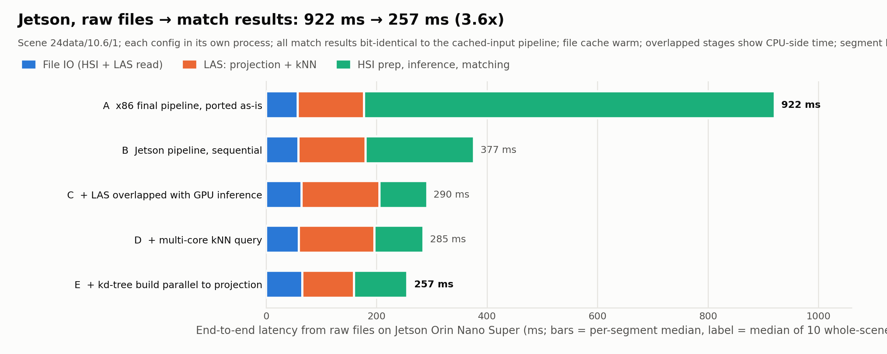
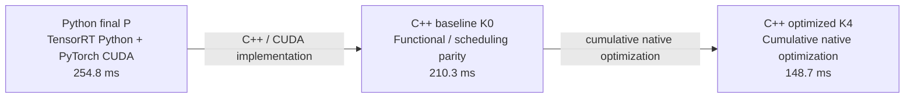
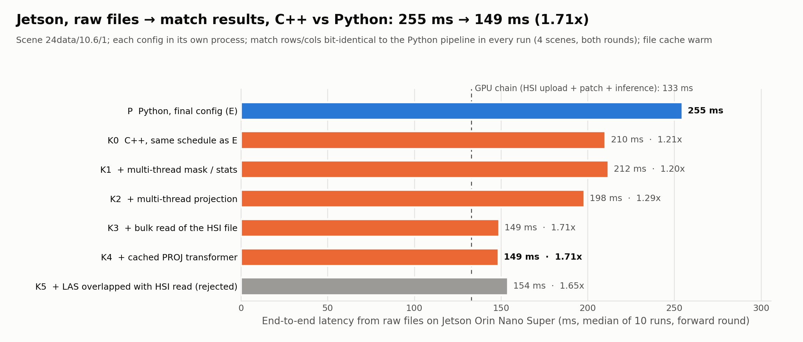
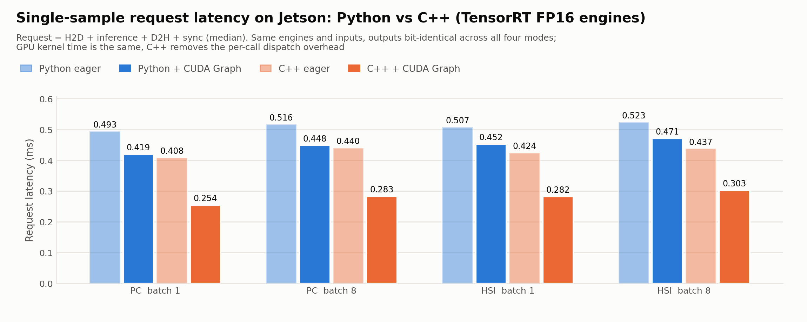
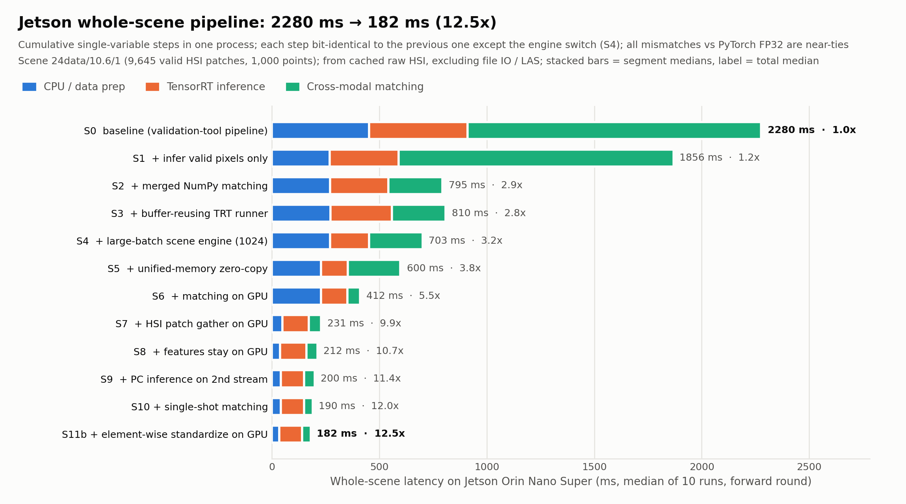
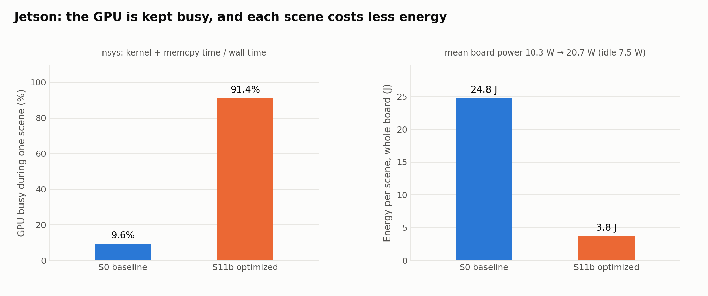
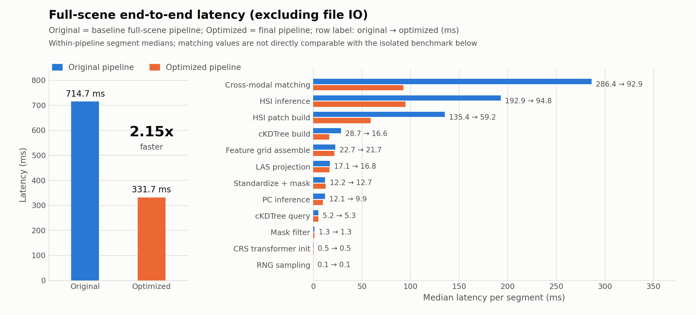
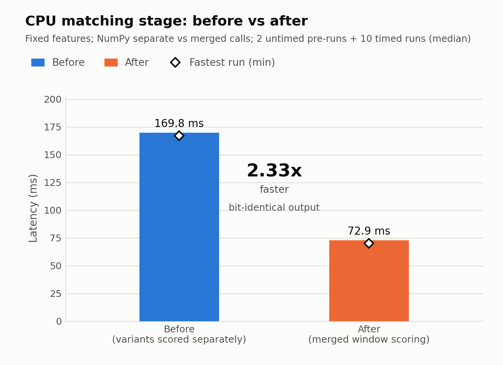
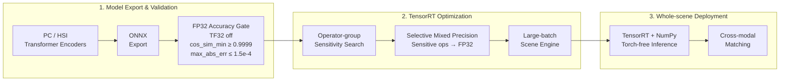

# hspc-transformer-edge-inference

本仓库记录了我基于自己的硕士课题（HSI-LiDAR 点云与高光谱跨模态特征匹配）进行的端侧推理部署改造工作。

在 x86 平台上，我将课题中已训练完成的两个 Transformer 编码器（点云 PC / 高光谱 HSI）导出为 ONNX，构建 TensorRT FP32 / FP16 推理引擎，并以 PyTorch FP32 为基线完成精度验证、性能测试和整景推理链路优化。

随后将部署链路迁移到 **NVIDIA Jetson Orin Nano Super**，在板上重新构建 TensorRT 引擎并完成精度、性能、整景链路与能效验证；最后使用 **C++17 + TensorRT C++ API + CUDA** 重写从原始 HSI/LAS 文件到跨模态匹配结果的完整端侧链路，并与 Python reference 做逐级一致性验证（见[「Jetson Orin Nano Super 端侧部署」](#jetson-orin-nano-super-端侧部署)）。

**部署主线**：PyTorch FP32 → ONNX → TensorRT → x86 Python Runtime → Jetson Python Runtime → **C++/CUDA Runtime** → Native Optimization → Final Edge Deployment

**技术栈**：C++17 · CUDA · TensorRT · Jetson Orin Nano Super · ONNX · Python · GDAL · PROJ

**三个核心结果**（完整数据见下方「结果速览」，均来自 `results/`）：

- **Jetson C++ 原始文件 → 匹配结果**：默认景 Python 254.8ms → C++ 148.7ms（1.71x）；4 个场景为 1.7～2.1x，最终匹配行列与 Python reference 逐位相同（`results/jetson/cpp_e2e_summary.json`）。
- **Jetson Python 原始文件 → 匹配结果**：默认景 921.5ms → 256.7ms（≥3.58x，保守下界）；4 个场景的保守下界为 3.23～3.58x（`results/jetson/e2e_full_summary.json`、`e2e_las_summary.json`）。
- **Jetson 缓存输入推理链路**：默认景同进程累加实验 2280.0ms → 181.8ms（12.54x）；后续独立的 4 景验证为 12.0～15.4x（`results/jetson/opt_final2_compare.json`、`opt_final2_multiscene_*.json`）。

不同结果对应不同测量边界，因此不将 1.71x、≥3.58x 和 12.54x 串联成一个总加速比。


## 完整端侧部署技术路线

这套工程不是单点 benchmark，而是从训练完成的双编码器出发，依次完成模型转换、精度闸门、TensorRT 优化、x86 整景部署、Jetson 板上重建与端侧优化，再迁移到 C++/CUDA 原生 Runtime，并用精度、逐位一致性、延迟、冷启动、内存和能耗做最终验收。


```mermaid
flowchart LR
    A["PyTorch FP32<br/>PC / HSI Transformer"]
    B["ONNX Export"]
    C["TensorRT FP32<br/>Accuracy Gate<br/>cos_sim_min ≥ 0.9999<br/>max_abs_err ≤ 1.5e-4"]
    D["FP16 / INT8<br/>Precision Exploration"]
    E["Selective Mixed Precision<br/>+ Large-batch Engine"]
    F["x86 Python Runtime<br/>Whole-scene Deployment"]
    G["Jetson Orin Nano Super<br/>On-device Engine Rebuild"]
    H["Jetson Python Runtime<br/>GPU Pipeline / Overlap / Unified Memory"]
    I["C++ / CUDA Runtime<br/>Functional-Parity Baseline"]
    J["Native C++ Optimization<br/>K0 → K4"]
    K["Final Validation<br/>Correctness · Latency · Memory · Energy"]

    A --> B --> C --> D --> E --> F --> G --> H --> I --> J --> K
```

关键 Gate 贯穿整个流程：TensorRT 相对 PyTorch FP32 使用精度阈值；Python 与 C++ 的确定性中间结果使用逐位一致性；最终端侧交付同时检查整景结果、延迟、冷启动、进程内存和整板能耗。

## 输入、输出与业务流程

任务是给同一片地面区域的两种传感器数据找像素级对应关系：**HSI**（高光谱影像，每个像素有 342 个波段的光谱值，
机载相机采集）和 **LAS**（LiDAR 点云文件格式，记录三维坐标）。两个独立训练的 Transformer 编码器分别把 HSI 上
每个像素的 3×3 邻域 patch 和点云里每个点的 15 邻域几何偏移，编码成同一个 1024 维特征空间里的向量；再对点云的
每个采样点，在高光谱影像上以对应位置为中心的 11×11 窗口内，按 cosine 相似度（**DTP**）或再叠加空间距离惩罚
（**DTP+Spatial**，两种打分配置）找最匹配的像素，作为这个点在影像上的对应位置。

```
HSI 文件 ──▶ 标准化 / NDVI 掩膜 / 3×3 patch 提取 ──▶ HSI Encoder ──┐
                                                                    ├──▶ 11×11 窗口内匹配 ──▶ 逐点匹配的像素行列
LAS 点云 ──▶ 投影 / 采样 / kNN 邻域偏移 ─────────▶ PC Encoder ───┘
```

本仓库做的是这条链路"部署侧"的工程：两个编码器的结构定义、训练权重，以及匹配打分的具体规则
（DTP/DTP+Spatial 的加权方式）属于未发表课题内容，不在本仓库里（见下方「公开范围」）；本仓库公开的是把
两个已训练好的编码器，尝试量化、完成 ONNX/TensorRT 导出与推理加速，并进一步部署到 Jetson 和 C++/CUDA Runtime 的工程过程与实测数据。

两个平台的数据分开记录，互不代替：

- x86：TensorRT 10.13.3.9（CUDA 12.9）｜PyTorch 2.13.0（CUDA 13.0，FP32 基线）｜Python 3.10｜ONNX opset 17｜
  RTX 3060 12GB（SM 8.6，WSL2）。结果在 `results/*.json`。
- Jetson：Orin Nano Engineering Reference Developer Kit Super（SM 8.7，8 个 SM，与 CPU 共享 7.4 GiB 内存）｜
  L4T R36.4.7 / JetPack 6｜TensorRT 10.7.0｜CUDA 12.6｜PyTorch 2.5.0（NVIDIA Jetson 版，FP32 基线）｜MAXN_SUPER。
  **所有端侧数字都在板上实测**，结果在 `results/jetson/`，完整报告见 [docs/jetson.md](docs/jetson.md)。

公开脚本的软件依赖与系统前提见 [docs/environment.md](docs/environment.md)。

## 关键工程问题与解决

部署过程中几个反直觉的发现，比单纯的加速比更能说明工程方法：

1. **TensorRT 隐式 INT8 校准路径没有真正执行 INT8。** 使用 `--exportLayerInfo` 逐层核查后确认，x86 上对 PC / HSI 各独立重建 3 次、Jetson 上对隐式校准与 FP16 对照引擎进行检查时，均为 0 个 Int8 层。Transformer 主体由 TensorRT 的 Myelin 融合核执行，隐式校准产生的 scale 并未形成可交付的 Int8 执行路径；真正进入 Int8 执行的是显式 QDQ 量化。详见下方「技术要点」第 3 条。

2. **FP16 默认构建结果不可复现，得自己搜敏感层。** 同一份 ONNX 用 TensorRT 默认精度模式反复构建，
   cos_sim_min 会在 0.99～1.0 之间随机跳动；用受控重建实验确认了大 batch 下 TensorRT 会选择不同 tactic、
   部分构建退回接近 FP32 的实现——具体的不稳定性来源推测与 TensorRT 内部基于计时的 tactic 自动调优受 GPU
   负载/时钟噪声影响有关，但没有做锁频等隔离实验进一步确认。改成显式约束 + 按算子分组的敏感度贪心搜索，
   只把搜到的敏感层组（如 HSI 的 stem）强制保留 FP32，其余用 FP16，5 次独立构建全部稳定。详见下方
   「技术要点」第 1 条。

3. **要让 C++ 和 Python 逐位一致，得抠到 NumPy 的求和顺序和 ARM 的浮点融合。** 第一版 C++ 算出的均值/标准差，
   约三成波段和 NumPy 差最后一位。定位发现 NumPy 对 `.mean(axis=(1,2))` 的实际求和顺序是"每 8192 个元素一块
   （默认缓冲区大小），块内 pairwise、块间顺序累加"，不是整幅数据一次 pairwise；同时 aarch64 上 GCC 默认把
   `a*b+c` 融合成一条 FMA 指令，而 NumPy/laspy 的等价计算是两步舍入。按 NumPy 的分块口径重写，CMake 里显式
   关掉 FMA 融合（`-ffp-contract=off` / `-fmad=false`）后，4 个场景全部逐位相同。详见
   [docs/jetson.md](docs/jetson.md) 第 5 节。

4. **点云近邻查询的"距离并列"会直接改变模型输入，不是可以忽略的浮点误差。** 一个规则网格重采样的场景里，
   1000 个采样点中有 939 个点的 16 近邻内存在距离并列，其中 589 个正好在第 15/16 名的取舍边界发生并列；如果并列时的取舍规则和 Python 版（SciPy cKDTree）
   不一样，106 个点的邻域集合、907 个点的邻域顺序都会变，直接改变 PC 编码器的输入。所以没有用通用 kd 树库，
   而是把 SciPy 1.15.2 的 cKDTree C++ 内核直接编进了 C++ 部署里。详见 [docs/jetson.md](docs/jetson.md) 第 5 节。

## 精度与护栏：三层判据

不同阶段采用不同强度的验收标准，不把 FP16 数值误差、实现错误和最终任务结果混为同一类问题：

- **引擎级精度 Gate**：TensorRT 引擎相对 PyTorch FP32 使用数值精度阈值。FP32（TF32 off）的正式 Gate 为 `cos_sim_min ≥ 0.9999` 且 `max_abs_err ≤ 1.5e-4`；FP16 另按对应精度与任务指标验收，不要求与 FP32 逐位相同。
- **实现级一致性 Gate**：C++ 与 Python reference 对同一套确定性计算产生的中间结果进行逐级比较，包括掩膜、统计量、投影坐标、采样、近邻偏移、patch 和编码器特征。本应确定性相同的结果要求逐位一致。
- **任务级 Gate**：GPU 匹配中的 cosine 数值不要求逐位一致，因为归约顺序可能不同；但最终每个点对应的匹配行列必须与 Python reference 一致。FP16 相对 FP32 的最终部署结果则同时报告跨模态匹配一致率及近平局分析。

这种分层方式可以区分模型精度损失、运行时浮点差异和真实实现错误。

## 结果速览

| 指标 | 结果 | 来源 |
|---|---|---|
| FP16 路径精度（cos_sim_min / 同模态最近邻 Top-1 一致率，200 条，vs PyTorch FP32） | PC 0.999998 / 99.5%　HSI 0.999847 / 99.0% | `results/stage2_trt_accuracy.json` |
| 单样本推理加速比（batch=1，p50，vs PyTorch FP32-GPU） | PC 5.8x　HSI 7.3x | `results/stage3_benchmark.json` |
| 整景推理链路耗时（不含文件 IO，同进程对比） | 714.7ms → 331.7ms（**2.15x**），基线为未优化的原始推理链路 | `results/stage7_final_e2e.json`（`overall_speedup_without_io`） |
| 跨模态匹配任务一致率（最终混合精度部署版 vs PyTorch FP32，1000点/景） | DTP 99.7%　DTP+Spatial 99.5% | `results/stage7_mixed_precision.json` |
| **Jetson** 单样本推理加速比（batch=1，p50，vs 板上 PyTorch FP32-GPU） | PC 14.2x（0.328ms）　HSI 14.8x（0.355ms） | `results/jetson/stage3_benchmark.json` |
| **Jetson** 从原始文件到匹配结果（含 HSI/LAS 读取、投影、kNN） | 默认景 921.5ms → 256.7ms（≥3.58x，保守下界）；4 个场景的保守下界为 3.23～3.58x | `results/jetson/e2e_full_summary.json`、`e2e_las_summary.json` |
| **Jetson C++** 从原始文件到匹配结果（vs Python final P，同板同场次交替测量） | 默认景 254.8ms → 148.7ms（1.71x）；4 个场景 1.7～2.1x；匹配行列与 Python 版逐位相同 | `results/jetson/cpp_e2e_summary.json` |
| **Jetson C++** 单样本请求延迟（batch=1，含拷贝与同步，vs Python + CUDA Graph） | PC 0.419 → 0.254ms、HSI 0.452 → 0.282ms；输出逐位相同 | `results/jetson/cpp_latency_summary.json` |
| **Jetson C++** 进程冷启动 / 每景能耗（整板）/ 进程内存峰值（vs Python） | 4.50s → 0.65s　/　4.60J → 3.20J　/　2,132 MB → 746 MB | `results/jetson/cpp_power_summary.json` |
| **Jetson** 整景推理链路（缓存的原始 HSI 起算，同进程累加对比） | 2280.0ms → 181.8ms（**12.54x**）；4 个场景 12.0～15.4x | `results/jetson/opt_final2_compare.json`、`opt_final2_multiscene_*.json` |
| **Jetson** GPU 忙碌率（nsys profiling run）/ 每景能耗（整板） | 9.6% → 91.4%　/　24.8J → 3.8J | `results/jetson/logs/nsys/*_gpu_busy.json`、`results/jetson/opt_final2_energy.json` |
| **Jetson** 跨模态匹配任务一致率（vs 板上 PyTorch FP32，4 景） | 99.2%～99.8%，不一致点全部为近平局翻转 | `results/jetson/opt_final2_multiscene_*.json` |

## Jetson Orin Nano Super 端侧部署

把同一份 ONNX 在板上重新构建引擎（`.plan` 与 GPU 架构、TRT 版本绑定，不能从 x86 拷过去），按原流程重做精度验证和 benchmark，
再针对端侧做整景推理加速，最后给出从原始文件到匹配结果的完整端到端数字。所有数字都在板上实测（MAXN_SUPER，时钟锁定）；
x86 数字只作为不同平台的对照，不混入端侧结果。完整过程见 [docs/jetson.md](docs/jetson.md)。

**精度与单样本延迟**（`results/jetson/`）：FP32(TF32 off) 闸门通过（PC max_abs 1.0e-5、HSI 1.0e-4）；FP16 下 PC 用默认精度即达标
（cos_sim_min 0.999993，3 次构建逐位相同），HSI 默认精度在板上同样复现了 x86 上的构建不稳定（3 次构建 cos_sim_min 0.990～0.996），
按 x86 选定的方案只把 `stem` 组保留 FP32 后达标且可复现（0.999705）。batch=1 延迟 PC 0.328ms / HSI 0.355ms，
比板上 PyTorch FP32 快 14.2x / 14.8x；再用 CUDA Graph 捕获固定形状的推理，GPU 段快约 30%，含下发、同步和拷贝的请求端到端快 11%～17%，
输出与不用 Graph 逐位相同（`opt_o4_latency.json`）。

**从原始文件到匹配结果**：部署入口 `scripts/deploy_jetson.py` 读取原始 HSI（GDAL）与 LAS 点云，完成前处理、两个编码器推理与跨模态匹配。
与"把 x86 最终链路（`deploy_scene.py`）原样搬到板上"相比，默认景 921.5ms → 256.7ms（≥3.58x，保守下界），4 个场景的保守下界为 3.23～3.58x（A 的总计是每次运行各顺序、不重叠分段的耗时之和再取 10 次中位数，不含分段之间少量未计时的代码，小于等于 A 的真实整景耗时；E 是整景墙钟中位数；所以这里的倍数是真实加速比的保守下界，不是精确值，完整说明见 [docs/jetson.md](docs/jetson.md) 第 4 节）；
每种配置的匹配结果都与缓存输入链路逐位相同，板上从原始文件算出的前处理产物也与 x86 逐位相同（`preprocess_guardrail.json`）。



**C++ 部署**：实际端侧部署一般是不带 Python 和 torch 的 C++ 可执行文件，所以 `cpp/` 下用 C++ 把整条链路重做了一遍，并与 Python 版对照：
TensorRT C++ 运行时（同一批 `.plan` 引擎，含 CUDA Graph）、自定义 CUDA kernel（标准化与 patch 提取融合、融合窗口匹配）、GDAL/PROJ C API，
以及直接编入的 SciPy kd 树内核（PC 编码器的输入对近邻顺序敏感，某个场景里 939/1000 个点的 16 近邻有距离并列，必须与 Python 版的取舍一致）。
Python 版保留为参考实现：C++ 的每个中间数组（掩膜、统计量、投影坐标、采样、近邻偏移、patch、特征）和最终匹配行列在 4 个场景上都与它**逐位相同**。
同一块板、同一场次交替测量：默认景 254.8ms → 148.7ms（1.71x），4 个场景 1.7～2.1x。K0 之后最主要的额外收益来自 HSI 文件读取：C++ 中经 GDAL `RasterIO` 读取约 55ms，针对满足条件的 ENVI BSQ float32 小端文件改为一次 `pread` 整块读取后约 8ms。
在 P → K0 中，融合匹配 kernel 将对应匹配路径从约 40.2ms 降至 4.7ms；此时整条 GPU 链路（上传、patch 生成、HSI 推理）约 133ms，
其中 HSI 推理约 107ms（与 Python 版是同一个引擎）。
单样本请求延迟（含拷贝与同步）PC 0.419 → 0.254ms、HSI 0.452 → 0.282ms（相对 Python + CUDA Graph，GPU 段耗时相同，差在每次调用的下发开销）；
进程从启动到出第一个结果 4.50s → 0.65s，进程内存峰值 2,132 MB → 746 MB，每景整板能耗 4.60J → 3.20J。没有采纳的尝试（多线程前处理无稳定收益、LAS 与 HSI 读取同时开始反而慢约 5ms 等）见 [docs/jetson.md](docs/jetson.md) 第 5 节。

### Python Runtime → C++/CUDA Runtime

Jetson 上保留 Python 最终版 P 作为 reference，再实现功能与调度语义对齐的 C++/CUDA baseline K0，并在 K0 基础上继续累加 K1～K4 的原生优化。

需要说明的是，K0 并不是只替换语言或运行时的“纯移植”：为了在 C++/CUDA 中实现同一条链路，K0 已包含标准化 + patch 融合、融合窗口匹配等原生 CUDA 实现。因此 P → K0 反映的是从 Python/Torch 链路迁移到 C++/CUDA 后的**综合实现收益**，不能单独解释成“Python 调度开销被移除”的纯运行时收益。

K0 → K4 则是后续累加优化。其中整景耗时的主要额外下降来自 K3 的 HSI 整块读取；K1/K2 在不同场景和轮次中有正有负，K4 的 PROJ 对象复用在单景总耗时上约为 0.3ms，接近测量噪声。


```mermaid
flowchart LR
    P["Python final P<br/>TensorRT Python + PyTorch CUDA<br/>254.8 ms"]
    K0["C++ baseline K0<br/>Functional / scheduling parity<br/>210.3 ms"]
    K4["C++ optimized K4<br/>Cumulative native optimization<br/>148.7 ms"]

    P -->|"C++ / CUDA implementation"| K0
    K0 -->|"cumulative native optimization"| K4
```

| Runtime | 实现定位 | 默认景 Jetson E2E |
|---|---|---:|
| Python final P | TensorRT Python + PyTorch CUDA，最终 Python reference | 254.8 ms |
| C++ baseline K0 | 功能与调度语义对齐 P；已包含完成原生链路所需的融合 CUDA kernel | 210.3 ms |
| C++ optimized K4 | K0 基础上的累加优化；主要额外收益来自 K3 的 HSI 整块读取 | 148.7 ms |

数据来自 `results/jetson/cpp_e2e_summary.json`。最终 K4 相对同场次 Python P 为 1.71x；4 个场景为 1.7～2.1x，倍数均由未取整的原始耗时计算，最终匹配行列与 Python reference 逐位相同。

### C++/CUDA Runtime 覆盖范围

公开的 C++ 部署并不只是调用一次 TensorRT API，而是覆盖完整部署链路：

- TensorRT engine lifecycle、execution context 与 dynamic batch；
- CUDA stream、异步推理与 CPU/GPU 调度；
- HSI / LAS 原生前处理与 GDAL/PROJ I/O；
- 自定义 CUDA kernel：标准化、patch 提取、特征归一化与跨模态窗口匹配；
- SciPy cKDTree C++ 内核复用，保证并列近邻行为与 Python reference 一致；
- Python → C++ 中间数组逐级回归，以及最终匹配行列的逐位一致性护栏。





**整景推理链路的逐步优化**：只看推理相关的部分（从缓存的原始 HSI 立方体起算，排除文件读取与 LAS 段），从验证工具式的写法（S0）出发，
每步只改一处、在同一进程里累加对比，2280.0ms → 181.8ms（**12.54x**）；另外 3 个未参与默认景优化调参的场景为 12.8～15.4x（正反两轮取正向）。



其中 S1 和 S2 直接沿用了 x86 阶段已经完成的整景链路优化：S1 只推理有效像元，S2 使用合并后的 NumPy 匹配实现。S1 → S2 从 1855.9ms 降至 795.4ms，是这条累加链中最大的单步下降。下面重点列出随后在 Jetson 上继续完成的 GPU、统一内存和并行优化。

S3 之后在 Jetson 上继续完成的优化包括（累加对比的拆分依赖顺序，只列来源、不报百分比）：

- **把整条数据链路留在 GPU 上**：HSI patch 改为在 GPU 上一次 gather 生成、直接作为 TensorRT 的输入地址（原来是 CPU 单线程 Python 循环，
  6 核只用了 1 核），推理输出不回 host，直接在 GPU 上拼网格、做跨模态匹配，最后只取回 1000 个点的结果。
- **统一内存零拷贝**：Jetson 的 CPU 与 GPU 共用同一块物理内存，用 `cudaHostAllocMapped` 分配的 host 内存让 TensorRT 直接读写，
  消掉了 H2D/D2H 拷贝和一次 118MB 的 host 端整理拷贝（`scripts/deploy_scene.py` 的 `PinnedArray(mapped=True)`、`LiteTrtRunner.infer_ptrs`）。
- **匹配搬到 GPU**：11×11 搜索窗口固定形状后按点批量 gather + bmm，与逐点循环的 NumPy 版输出逐位相同。
- **大 batch 引擎**：板上重新扫描 profile 档位，选 1024（2048 只快 3%，显存翻倍，在 7.4 GiB 共享内存上构建还出现过一次 OOM）。
- **CPU 与 GPU 重叠**：点云推理放到第二个 stream 与 CPU 标准化并行；完整链路里 HSI 推理异步发射后立即做 LAS 段，kd 树构建再放到后台线程与投影并行，
  HSI 推理大部分藏在 CPU 工作后面（默认景剩约 29ms 要等 GPU，此时关键路径已是 GPU 推理本身）。

每一步都有护栏：除换引擎那一步外，每步的特征与匹配结果都与上一步**逐位相同**；每个配置与板上 PyTorch FP32 的不一致点全部是 FP32 判别裕度内的近平局翻转。

nsys 的独立 profiling run 中，S0 一次整景约 2.7s，GPU 忙碌时间占比为 9.6%；S11b 一次整景 188.7ms，GPU 忙碌时间占比为 91.4%，HSI 推理窗口内 GPU 忙碌率约 99%。这里的 nsys 数字用于分析时间线、kernel/memcpy 活跃区间和 GPU busy ratio；正式延迟数字来自不启用 profiler 的重复测量中位数，因此 nsys 中的 S0 约 2.7s、S11b 188.7ms，与正式累加表中的 2280.0ms、181.8ms 不要求完全相同，也不把差异简单归因于 profiler 开销。

HSI 推理本身约 107ms，是当前 TensorRT 版本、引擎、输入形状和 MAXN_SUPER 功耗模式下观察到的主要瓶颈。



**能效**（tegrastats 整板输入功率，空闲 7.5W）：优化后功率升高（10.3W → 20.7W，GPU 更忙），但每景能耗 24.8J → 3.8J，
每瓦吞吐提高 6.6 倍。

**尝试过但未采纳的**：标准化和掩膜整体搬到 GPU（快 16ms，但归约顺序不同，4 景里 3 景的匹配结果变了，只采纳了保持逐位相同的逐元素部分）、
stem 卷积用 TF32（推理只快 0.3%，重复构建不稳定）、`builderOptimizationLevel=5`（GPU 时间不变，构建 47s → 257s）、
kNN 查询改多核（只快 1～5ms：时间主要花在逐点组装偏移的 Python 循环上）、INT8（见下一段）。

**INT8**：TensorRT 原生隐式校准路径在 x86 和 Jetson 的逐层核查中均未产生 Int8 层，因此这些引擎不作为 INT8 结果报告。

显式 QDQ 路径确实产生了 Int8 层，但当前没有形成可交付方案。HSI QDQ 在 TensorRT 中精度明显下降，且直接使用 ONNX Runtime 执行同一个 QDQ 模型时也出现明显精度下降，因此 HSI 的主要问题已经存在于量化后的 QDQ 模型。

PC QDQ 在 Jetson 上 3 次独立 TensorRT 构建均稳定复现严重数值异常（`results/jetson/j2_qdq_stability.json`）。当前公开 evidence 中没有 PC QDQ 的 ONNX Runtime direct 对照，因此现有证据不足以进一步区分问题来自 QDQ 图本身还是 TensorRT 对该图的执行路径，本项目没有继续追查这一根因。

因此当前正式交付仍采用 FP16 / selective mixed precision，不宣称存在可交付 INT8。

**冷启动**（Python 部署入口；MAXN_SUPER、时钟锁定；新进程，页缓存未清；C++ 版见上）：部署入口加载两个引擎并分配 buffer 约 0.25s，第 1 次完整整景 0.69～0.77s
（含 CUDA/PROJ 的首次初始化），之后稳态 0.21～0.27s（4 景，`results/jetson/e2e_las_summary.json` 中 E 的 `cold_start_sec` / `engine_load_sec`）。

## x86：整景耗时与 CPU 段优化（研发起点）



Original 为原始整景验证链路，Optimized 为最终整景链路；取 `forward` 方向、不含文件 IO 的各分段中位数
（`results/stage7_final_e2e.json`，`forward.<配置>.segments_ms.<分段>.median_ms`）。图中 matching 的
286.4 → 92.9 ms 是两套整景流水线各自的分段中位数，除匹配实现外也受整条流水线配置影响。



该图固定输入特征，只对 NumPy 分开调用与合并调用进行独立微基准；每种实现计时前执行两次不计时预运行，随后重复
测量 10 次并取中位数。匹配段合并两个匹配变体、共享窗口内的 cosine/distance 计算（见技术要点第 2 条），前后输出
逐位一致（`results/stage7_cpu_profile.json` 的 `optimization_b_merged_score_window`）。因此图中的 72.9 ms 不能与
上一图整景流水线中的 92.9 ms 直接比较。

## x86 基础验证结果总表

<!-- results-table:start -->
对比基准为 PyTorch FP32（GPU）；精度在 200 条验证样本上计算，其中同模态最近邻 Top-1 一致率表示：分别排除样本自身后，PyTorch 与 TensorRT 在同模态样本中检索到同一个最近邻的比例；延迟为 batch=1 的 p50（warmup 50 / measure 300，CUDA event 计时）。表中 `[batch=1]` 表示列表里 `batch` 字段等于 1 的元素；字段级来源与补充验证信息见下方折叠 provenance。

| Model | Backend | Precision | Accuracy (cos_sim_min / same-modal NN Top-1 agreement) | Latency (batch=1, p50, ms) | Speedup vs PyTorch FP32 |
|---|---|---|---|---|---|
| PC | PyTorch | FP32 | reference | 1.577 | 1.0x |
| PC | TensorRT | FP32 (TF32 off) | 1.000000 / 100.0% | 0.397 | 4.0x |
| PC | TensorRT | FP32 (TF32 on) | 1.000000 / 100.0% | 0.353 | 4.5x |
| PC | TensorRT | FP16 mixed | 0.999998 / 99.5% | 0.273 | 5.8x |
| HSI | PyTorch | FP32 | reference | 1.820 | 1.0x |
| HSI | TensorRT | FP32 (TF32 off) | 1.000000 / 100.0% | 0.420 | 4.3x |
| HSI | TensorRT | FP32 (TF32 on) | 0.999997 / 100.0% | 0.353 | 5.2x |
| HSI | TensorRT | FP16 mixed | 0.999847 / 99.0% | 0.248 | 7.3x |
| HSI | TensorRT | INT8 (QDQ) | 0.754749 / 91.0% | 0.301 | 6.0x |

PC 的 INT8 QDQ 路径已放弃，说明见「技术要点」第 3 条。表中不含 “INT8 (implicit calibration)”：逐层核查显示这类引擎中没有任何 Int8 层，因此不作为 INT8 结果报告（见「技术要点」第 3 条）。

<!-- results-table:end -->

**数据来源与口径**

- 精度：`results/stage2_trt_accuracy.json`
- batch=1 延迟：`results/stage3_benchmark.json`
- Speedup：`PyTorch FP32-GPU p50 / 对应 TensorRT p50`
- `stage2_trt_accuracy.json` / `stage3_benchmark.json` 中的 `fp16` / `trt_fp16` 对应当前 `engines/*_fp16.plan`，即最终选择性混合精度引擎；旧 auto 引擎的性能结果见 `trt_fp16_legacy`，精度对照见 `results/stage7_mixed_precision.json` 的 `final_engines_promoted.note`。
- 最终选择性混合精度方案、稳定性验证与任务级一致率见 `results/stage7_mixed_precision.json`。
- PC 的 INT8 QDQ 路径已放弃，原因见「技术要点」第 3 条。

<details>
<summary><strong>展开查看字段级 provenance</strong></summary>

### PC

- PyTorch FP32 latency：`results/stage3_benchmark.json` → `results.pc.pytorch_fp32_gpu[batch=1].p50_ms`
- PyTorch FP32 speedup：基线自身相除，定义为 `1.0x`
- TensorRT FP32 (TF32 off) accuracy：`results/stage2_trt_accuracy.json` → `results.pc.fp32_notf32.cos_sim_min`, `results.pc.fp32_notf32.top1_agreement`
- TensorRT FP32 (TF32 off) latency：`results/stage3_benchmark.json` → `results.pc.trt_fp32_notf32[batch=1].p50_ms`
- TensorRT FP32 (TF32 off) speedup：`results.pc.pytorch_fp32_gpu[batch=1].p50_ms / results.pc.trt_fp32_notf32[batch=1].p50_ms`
- TensorRT FP32 (TF32 on) accuracy：`results/stage2_trt_accuracy.json` → `results.pc.fp32_tf32.cos_sim_min`, `results.pc.fp32_tf32.top1_agreement`
- TensorRT FP32 (TF32 on) latency：`results/stage3_benchmark.json` → `results.pc.trt_fp32_tf32[batch=1].p50_ms`
- TensorRT FP32 (TF32 on) speedup：`results.pc.pytorch_fp32_gpu[batch=1].p50_ms / results.pc.trt_fp32_tf32[batch=1].p50_ms`
- TensorRT FP16 accuracy：`results/stage2_trt_accuracy.json` → `results.pc.fp16.cos_sim_min`, `results.pc.fp16.top1_agreement`；同配置另有 5 次独立构建的稳定性验证，cos_sim_min 为 0.999995–0.999998（`results/stage7_mixed_precision.json` → `pc.stability.cos_mins`）
- TensorRT FP16 latency：`results/stage3_benchmark.json` → `results.pc.trt_fp16[batch=1].p50_ms`
- TensorRT FP16 speedup：`results.pc.pytorch_fp32_gpu[batch=1].p50_ms / results.pc.trt_fp16[batch=1].p50_ms`

### HSI

- PyTorch FP32 latency：`results/stage3_benchmark.json` → `results.hsi.pytorch_fp32_gpu[batch=1].p50_ms`
- PyTorch FP32 speedup：基线自身相除，定义为 `1.0x`
- TensorRT FP32 (TF32 off) accuracy：`results/stage2_trt_accuracy.json` → `results.hsi.fp32_notf32.cos_sim_min`, `results.hsi.fp32_notf32.top1_agreement`
- TensorRT FP32 (TF32 off) latency：`results/stage3_benchmark.json` → `results.hsi.trt_fp32_notf32[batch=1].p50_ms`
- TensorRT FP32 (TF32 off) speedup：`results.hsi.pytorch_fp32_gpu[batch=1].p50_ms / results.hsi.trt_fp32_notf32[batch=1].p50_ms`
- TensorRT FP32 (TF32 on) accuracy：`results/stage2_trt_accuracy.json` → `results.hsi.fp32_tf32.cos_sim_min`, `results.hsi.fp32_tf32.top1_agreement`
- TensorRT FP32 (TF32 on) latency：`results/stage3_benchmark.json` → `results.hsi.trt_fp32_tf32[batch=1].p50_ms`
- TensorRT FP32 (TF32 on) speedup：`results.hsi.pytorch_fp32_gpu[batch=1].p50_ms / results.hsi.trt_fp32_tf32[batch=1].p50_ms`
- TensorRT FP16 accuracy：`results/stage2_trt_accuracy.json` → `results.hsi.fp16.cos_sim_min`, `results.hsi.fp16.top1_agreement`；同配置另有 5 次独立构建的稳定性验证，cos_sim_min 为 0.999784–0.999801（`results/stage7_mixed_precision.json` → `hsi.stability.cos_mins`）
- TensorRT FP16 latency：`results/stage3_benchmark.json` → `results.hsi.trt_fp16[batch=1].p50_ms`
- TensorRT FP16 speedup：`results.hsi.pytorch_fp32_gpu[batch=1].p50_ms / results.hsi.trt_fp16[batch=1].p50_ms`
- TensorRT INT8 QDQ accuracy：`results/stage2_trt_accuracy.json` → `results.hsi.int8_qdq.cos_sim_min`, `results.hsi.int8_qdq.top1_agreement`
- TensorRT INT8 QDQ 补充核查：同一 QDQ 图经 TensorRT 独立重建 3 次，cos_sim_min 为 0.7474–0.7547；不经 TensorRT、直接用 ONNX Runtime 运行该 QDQ 模型，cos_sim_min 为 0.7858–0.8582，同样偏低（`results/hsi_qdq_check.json` → `trt_rebuilds[*].cos_sim_min`、`ort_direct.*.cos_sim_min`）。因此 HSI 的主要精度损失在 TensorRT 执行之前已经存在于量化后的 QDQ 模型中。PC QDQ 当前缺少对应的 ONNX Runtime direct 对照，不在此处进一步归因。
- TensorRT INT8 QDQ latency：`results/stage3_benchmark.json` → `results.hsi.trt_int8_qdq[batch=1].p50_ms`
- TensorRT INT8 QDQ speedup：`results.hsi.pytorch_fp32_gpu[batch=1].p50_ms / results.hsi.trt_int8_qdq[batch=1].p50_ms`

</details>

主要性能图表和 `assets/results_table.md` 由 `scripts/make_readme_assets.py` 从对应 `results/*.json` 生成；脚本同时对 README 中多项关键展示数字与口径进行一致性检查。README 中的结果表应与生成的 `assets/results_table.md` 保持同步，正式数字仍以对应 JSON artifact 为 Source of Truth。

## x86 部署工程流程（补充）

<details>
<summary><strong>展开查看 x86 阶段划分与关键命令</strong></summary>


```mermaid
flowchart LR
    subgraph S1["1. Model Export & Validation"]
        A["PC / HSI<br/>Transformer Encoders"]
        B["ONNX<br/>Export"]
        C["FP32 Accuracy Gate<br/>TF32 off<br/>cos_sim_min ≥ 0.9999<br/>max_abs_err ≤ 1.5e-4"]
        A --> B --> C
    end

    subgraph S2["2. TensorRT Optimization"]
        D["Operator-group<br/>Sensitivity Search"]
        E["Selective Mixed Precision<br/>Sensitive ops → FP32"]
        F["Large-batch<br/>Scene Engine"]
        D --> E --> F
    end

    subgraph S3["3. Whole-scene Deployment"]
        G["TensorRT + NumPy<br/>Torch-free Inference"]
        H["Cross-modal<br/>Matching"]
        G --> H
    end

    C --> D
    F --> G
```

该流程对应三个阶段：模型导出与精度闸门、TensorRT 精度/性能优化，以及不依赖 torch 的整景部署链路。

关键命令各一条（完整参数见对应脚本）：

```bash
# 选择性混合精度构建（HSI，敏感层组 stem 保留 FLOAT）
python scripts/build_trt.py --which hsi --modes fp16 --precision-policy mixed --fp32-groups stem

# 整景批量推理部署入口（不依赖 torch）
python scripts/deploy_scene.py --precision fp16 --engine-tier scene
```

</details>

## 技术要点

1. **选择性混合精度**：TensorRT 默认精度模式（`auto`）下重复构建同一份 ONNX，精度会在
   cos_sim_min 0.99～1.0 之间随机跳动，构建结果不可复现（`results/followup_stage6_verification.json`）。
   改用 `OBEY_PRECISION_CONSTRAINTS` + 按算子分组的敏感度搜索，只把贪心搜到的敏感层组保留
   FLOAT，其余 HALF：5 次独立构建全部稳定，相对纯 HALF 的速度损失，默认 profile（batch64）
   <4%、大 batch profile（batch=1024）<7%（`results/stage7_mixed_precision.json`）。

2. **整景批量推理**：大 batch profile 配合选择性混合精度，比 batch64 的 engine 快 2.1～2.5x
   （`results/stage7_batch_pinned.json`，大 batch profile 实测；交付的 max2048 档与之相差
   <5%，见 `results/stage7_scene_engine_sweep.json`）。换上大 batch engine 后瓶颈转移到 CPU
   段，重写匹配算法（合并两个匹配变体、共享窗口内的 cosine/distance 计算、去掉 meshgrid），
   匹配段耗时 169.8ms → 72.9ms（2.33x，`results/stage7_cpu_profile.json`）。另外发现：pageable
   host 内存下，TensorRT 的 H2D/D2H "异步" 拷贝实际会退化成同步拷贝
   （`results/followup_stage6_verification.json`）；实测当前写法下 pinned 内存无稳定收益，
   推断需配合数据直写与双缓冲流水线（未实现）。

3. **INT8 路径**：TensorRT 原生隐式校准路径经逐层核查后确认没有真正执行 Int8：x86 对 PC / HSI 各独立重建 3 次，所有构建均为 0 个 Int8 层；Jetson 对隐式校准与 FP16 对照引擎的逐层导出也得到相同结论。因此这些结果不作为 INT8 性能结果报告。

   真正进入 Int8 执行的是显式 QDQ 路径。HSI QDQ 在 TensorRT 和 ONNX Runtime direct 中均出现明显精度下降；PC QDQ 在 Jetson 上 3 次独立 TensorRT 构建稳定复现严重数值异常，但当前公开 evidence 没有 PC 的 ONNX Runtime direct 对照，因此不进一步断言根因位于 QDQ 图或 TensorRT Runtime 中。

   当前项目没有形成满足精度要求的可交付 INT8，正式部署使用 FP16 / selective mixed precision。

4. **计时方法**：逐次 CUDA 同步会在两次 kernel 之间引入同步气泡，使测量的延迟偏高、制造
   假的长尾。改为用 CUDA event 批量记录、末尾统一同步，并与 `trtexec` 交叉验证：偏差
   ≤4%（`results/stage3_benchmark.json` 对照 `results/logs/trtexec_*_fp16_mixed_*.log`）。

## 已知限制

- `.plan` 引擎文件不能跨平台，x86 与 Jetson 各自在本机构建（Jetson 的构建配置与 sha256 见
  `results/jetson/engine_manifest.json`）；两个平台的 TensorRT 版本不同（10.13 / 10.7），数字不是同口径
- x86 上的端到端验证只做了单一场景；Jetson 上做了 4 个场景（`results/jetson/opt_final2_multiscene_*.json`、`e2e_full_summary.json`）
- 没有可交付的 INT8：隐式校准路径实际没有执行 Int8（见技术要点第 3 条，`results/stage3_benchmark.json` 里的
  `trt_int8_implicit` 行因此不代表 INT8 性能）；显式 QDQ 能产生 Int8 层但当前精度不达标，PC 路径的异常根因尚未完全隔离，本项目未继续优化
- Jetson 上的文件读取是页缓存命中时的数字（没有清缓存）；所有端侧数字都在 MAXN_SUPER、时钟锁定下测得，其他功耗模式未测
- C++ 部署只支持未压缩 LAS（不支持 LAZ）；HSI 整块读只在 ENVI BSQ float32 小端时启用（否则走 GDAL）；GDAL/PROJ 用 conda 环境里的库；没有 INT8

## 目录结构

```
scripts/hspc_common.py       共享模块：确定性设置、strict 加载、样本切分、精度指标
scripts/export_onnx.py       PyTorch → ONNX 导出
scripts/verify_onnx.py       ONNX 精度验证
scripts/build_trt.py         TensorRT engine 构建（含选择性混合精度）
scripts/ptq_modelopt.py      ModelOpt PTQ（显式 QDQ 量化）
scripts/trt_runner.py        TensorRT 推理封装（torch 版）
scripts/verify_trt.py        TensorRT 精度验证
scripts/benchmark.py         延迟 / 吞吐 benchmark
scripts/preprocess.py        前处理（HSI/PC 输入张量构建、LAS 投影、kNN）
scripts/gen_reference.py     生成板上 FP32 reference（用于跨平台/板端精度核查）
scripts/deploy_scene.py      部署入口：不依赖 torch 的整景推理链路
scripts/e2e_stage_a_preprocess.py / e2e_stage_b_infer.py   端到端场景验证（前处理 / 推理+匹配）
scripts/stage6_*.py          精度稳定性复核、engine 构建不确定性诊断
scripts/stage7_*.py          混合精度搜索、scene engine 扫描、CPU 段优化、最终整景对比
scripts/deploy_jetson.py     Jetson 部署入口：从原始 HSI/LAS 到匹配结果的完整链路（最终配置）
scripts/jetson_scene_opt.py  Jetson 整景加速实验：累加对比、档位扫描、CUDA Graph 延迟、能效、冷启动
scripts/cpp_guardrail.py     C++ 部署的逐位护栏：C++ 导出的中间数组与 Python 参考链路逐数组比较，以及 kNN 并列、窗口覆盖统计
scripts/cpp_*_run.sh、cpp_*_summarize.py   C++ 与 Python 的板上对比（延迟、整景、冷启动/内存/能效）的运行与汇总脚本
scripts/make_readme_assets.py  生成 README 图表与 assets/results_table.md（数据全部读自 results/*.json）
cpp/                         C++ 部署（TensorRT C++ 运行时、CUDA kernel、GDAL/PROJ 前处理、整景程序 hspc_deploy）；CMake 构建，见 docs/jetson.md 第 5 节
cpp/third_party/scipy_ckdtree/  SciPy cKDTree 建树与 kNN 内核（BSD-3，保证并列近邻的取舍与 Python 版一致）
assets/                      README 引用的结果图表
engines/build_manifest.json  正式交付 engine 的构建配置、精度策略、sha256（不含 .plan 本身）
results/                     各阶段精度 / 性能 JSON 结果，以及 trtexec 交叉验证日志
results/jetson/              Jetson 板上实测的全部结果（精度、benchmark、优化对比、能效、nsys 统计）
docs/jetson.md               Jetson 移植与优化的完整报告
docs/environment.md          x86 / Jetson 软件环境与依赖说明
LICENSE                      仓库使用与授权条款
```

## 公开范围

本仓库不含：模型结构定义、训练权重、原始/校准样本数据（均属于未发表的硕士课题内容），
以及跨模态匹配打分规则（`scripts/matching.py` 与 `cpp/src/matching_rule.cuh`，课题方法本身）。

本仓库包含：除课题私有模型定义、训练权重和跨模态匹配规则外的部署工程代码，包括 ONNX 导出、
TensorRT 构建、精度验证、benchmark 和整景推理链路优化，以及对应实验结果 JSON。由于模型结构、
训练权重及跨模态匹配规则未公开，本仓库无法独立完成端到端复现；公开内容用于展示部署工程实现、
实验方法与结果证据。

公开版本缺少 `cpp/src/matching_rule.cuh` 时，CMake 会跳过依赖私有匹配规则的 `hspc_deploy`；
不依赖该规则的 `hspc_latency` 和 `hspc_prep_check` 仍可构建。

## 使用与授权

本仓库仅供成果展示与技术审阅，保留一切权利。除 GitHub 服务条款允许的平台内使用、查看和 fork 外，未经作者事先
书面许可，不得复制、修改、再发布、商业使用或创作衍生作品。第三方组件不受上述限制，按各自目录中附带的许可证授权。
详见 [LICENSE](LICENSE)。
